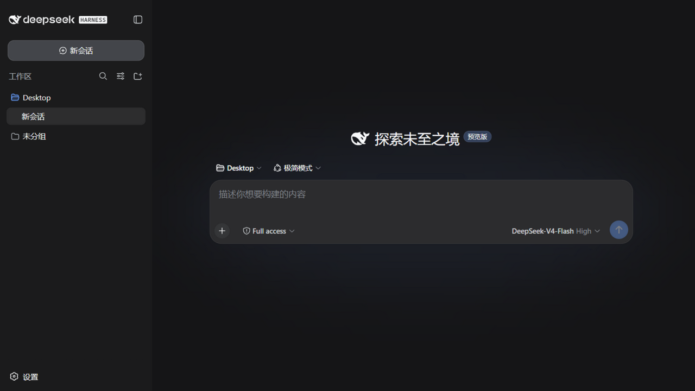
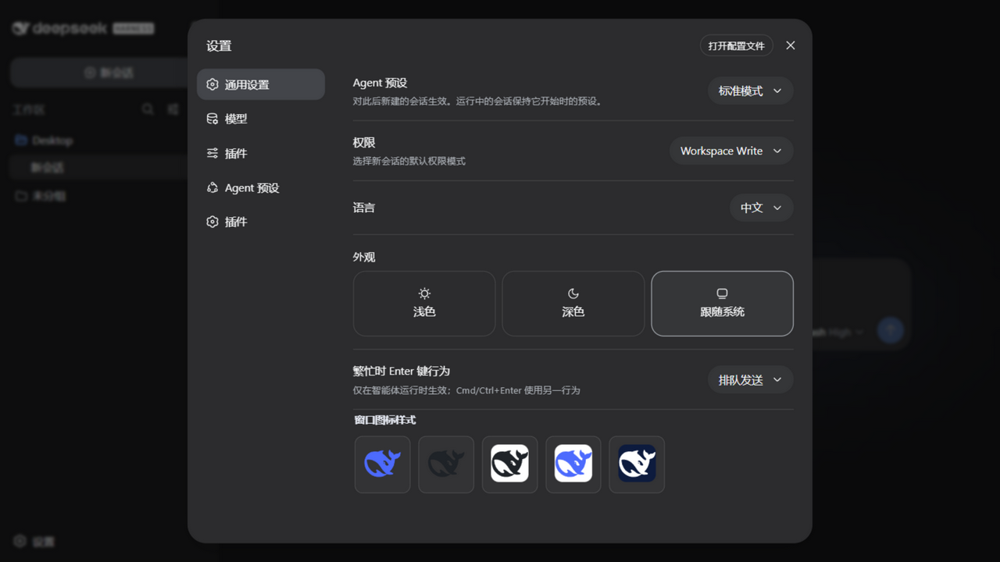
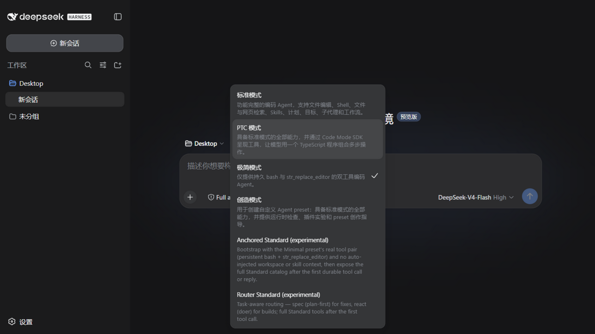

<div align="center">

# 🐋 DSH4Win

**DeepSeek Harness for Windows · 开箱即用桌面封装 · Out-of-the-box Desktop Wrapper**

双击即用 · 零依赖 · 原生窗口 · 中文界面 | Double-click to run · Zero dependencies · Native window

[](LICENSE)
[](https://github.com/kylian-08/DeepSeek_Harness_For_Windows)
[]()
[]()

**DSH4Win** wraps the official [DeepSeek Harness](https://github.com/deepseek-ai/deepseek-harness) into a native Windows desktop app — no terminal, no Node.js setup, no manual config. Install, double-click, done.

**DSH4Win** 把官方 [DeepSeek Harness](https://github.com/deepseek-ai/deepseek-harness) 封装成原生 Windows 桌面应用 —— 不需要终端、不需要装 Node.js、不需要手动配置。装完双击即用。

</div>

---

## 🌱 项目缘起 · Origin Story

前段时间 DeepSeek Harness 正式版发布，我在自己的 Windows 电脑上第一时间试用，却大失所望——完全没有感受到正式版相对预览版有什么提升。

后来我在 Debian 上尝试了极简模式，体感竟轻松超过了 Claude Opus 4.8 的水平，让我大为不解。仔细研究、又在开源社区里翻找信息后我才明白：原来官方并没有针对 Windows 做专门优化，导致首轮工具锚定失败，后续表现也因此大打折扣。

于是我从社区大佬的插件入手，做了一定的修改，成功把 Debian 环境下的智能水准稳定复现到了 Windows 上。

我一直想把 AI 安利给身边各行各业的朋友，问了一圈大家的意见，回答出奇一致：亲手部署 dsh 的门槛太高了。于是，这个项目应运而生——

**专为 Windows 用户与小白用户打造的开箱即用版 DeepSeek**：

- **双模式强化**：新增 `flash增强模式` 与 `windows增强模式`，专门强化其在 Windows 上的表现。`flash增强模式` 能大幅提升 deepseek-v4-flash 的能力，`windows增强模式` 则同时增益 flash 与 pro 模型。
- **图标自由切换**：内置 5 套官方鲸鱼图标，随时换肤——一个没什么用、但赏心悦目的小功能 😄
- **运行时注入**：插件免重启热注入，Windows 桌面版与 Web UI 保持完全一致的体验。
- **双启动形态**：Windows 桌面版与 WebUI 均可启动，与官方 Harness 自由切换、数据互通。

---

## ✨ 为什么选择 DSH4Win · Why DSH4Win

DeepSeek Harness 官方以 CLI / `npx` 方式分发，对普通 Windows 用户并不友好。DSH4Win 将其**深度封装为原生 Windows 桌面应用**。

The official DeepSeek Harness is distributed via CLI / `npx`, which is unfriendly for average Windows users. DSH4Win deeply wraps it into a native desktop app.

| 对比项 Compare | 官方 dsh（CLI） | **DSH4Win（本封装 This wrapper）** |
|---|---|---|
| 启动方式 Launch | 打开终端输 `npx dsh web` | **双击 exe，即开即用 Double-click** 🚀 |
| Node.js 环境 | 需自行安装 Required | **随附独立 Node 24 运行时 Bundled** |
| 原生模块 Native modules | 依赖编译环境 | 预编译 koffi / node-pty / node:sqlite，开箱即用 |
| 窗口体验 Window | 浏览器标签页 | **原生窗口 + 任务栏图标 Native window** |
| 图标 Icon | 默认样式 | **DeepSeek 官方鲸鱼图标，5 套可切换 5 whale skins** 🎨 |
| 安装分发 Install | 手动配置 | **向导式 setup.exe 安装包** |
| 插件生态 Plugins | 手动装配 | **预装 windows增强 / flash增强 插件 + 运行时注入器** |
| 数据 Data | `~/.dsh` | **沿用同一份 `~/.dsh`**，无缝迁移 |

---

## 📸 界面预览 · Screenshots

| 主界面 Main UI | 图标样式设置 Icon Settings | 预装 Agent 预设 Presets |
|---|---|---|
|  |  |  |

---

## 🎨 特色功能 · Features

### 1. 官方鲸鱼图标 · 5 套可切换 / Official Whale Icon · 5 Switchable Styles

从 dsh 官方前端提取的 **DeepSeek 品牌鲸鱼矢量路径**，精心制作 5 套图标：

The official DeepSeek whale vector path is extracted from the dsh frontend and rendered into 5 styles:

| 样式 Style | 说明 Description |
|---|---|
| 🐋 透明蓝鲸 Blue (default) | 透明底 + 品牌蓝，任务栏/桌面都清晰 |
| ⚫️ 透明黑鲸 Black | 透明底 + 深灰 |
| ⬜️ 白底黑鲸 White-Black | 白底 + 深灰 |
| 🔵 白底蓝鲸 White-Blue | 白底 + 品牌蓝 |
| 🌊 蓝底白鲸 DeepBlue-White | 深蓝底 + 白 |

**在设置 → 窗口图标样式中一键切换，即时生效**，重启保持，源码版与桌面版共用同一份配置。

Switch anytime in **Settings → 窗口图标样式 (Window Icon Style)** — takes effect immediately and persists across restarts; shared by both the CLI and desktop versions.

### 2. 预装高效 Agent 预设 / Pre-installed Agent Presets

| UI 模式名 Preset Name | 插件来源 Source | 核心机制 Mechanism |
|---|---|---|
| **windows增强模式** | [xiaobright/dsh-anchored-standard](https://github.com/xiaobright/dsh-anchored-standard) | 极简工具锚定开局 + 首工具后全量提升 |
| **flash增强模式** | [yjh051108/dsh-routing-suite](https://github.com/yjh051108/dsh-routing-suite) | 任务感知思维模式路由（生成/修复/模糊自动分流） |

> 💡 `dsh-routing-suite` 是「套装」：`flash增强模式` 只是其中路由预设；套装附带的 **dsh-super-injector 注入器** 常驻所有模式（`dev_*` 运行时插件工具）。`flash增强模式` 的路由机制构建在 `windows增强模式` 的锚定机制之上。

### 3. 运行时插件注入器 / Runtime Plugin Injector

BepInEx 式插件注入：任意本地 DSH 插件可**免重启注入**运行中的实例，自带热重载、一键自检、卸载即净、插件管理 UI。

### 4. 端口自适应 / Port Auto-fallback

默认 `127.0.0.1:3080`；端口被占用时**自动切换随机端口**，桌面版与网页版互不冲突。

### 5. 优雅退出 / Graceful Exit

关闭窗口即彻底退出应用，**自动清理后台 dsh 服务进程**，无残留。

---

## 📦 快速开始 · Quick Start

```powershell
# 方式一：安装版（推荐）Option 1: Installer (recommended)
1. 下载并运行 DSH4Win-Setup-1.0.0.exe
2. 按向导安装（可自定义目录）
3. 从桌面快捷方式启动

# 方式二：便携版 Option 2: Portable
解压 win-unpacked 目录，直接运行 DSH4Win.exe
```

首次启动后 After first launch：
1. 在 dsh 设置页配置 API Key（默认 `deepseek-v4-flash`）
2. 新建会话，可在预设菜单选择 **windows增强模式** 或 **flash增强模式**
3. 在设置 → 窗口图标样式 选择喜欢的图标

---

## 🖥️ 两种启动方式 · Two Ways to Launch

本封装**同时支持**命令行 WebUI 与原生桌面（WinUI）两种形态，数据完全互通：

| 形态 Form | 启动方式 Launch | 特点 Notes |
|---|---|---|
| **WebUI（浏览器版）** | 双击 **`start-webui.bat`** 或 `npx dsh web` → 访问 `http://127.0.0.1:3080` | 官方 CLI 形态，适合开发者 |
| **WinUI（桌面版）** | 双击 `DSH4Win.exe` | Electron 原生窗口，免命令行、免装 Node，内置同一套 Web UI + 任务栏鲸鱼图标 |

> 💡 两者共用 `~/.dsh`（会话、插件、图标设置互通）。**同一时间只运行一个**（都监听 3080；桌面版会自动切随机端口）。

---

## 🔧 本封装相对上游的全部改动 · Changes vs Upstream

### 桌面壳（Electron）
| 改动 Change | 说明 Description |
|---|---|
| `electron/main.js` | 新增主进程：spawn 随附 Node 运行 dsh、端口自适应、图标设置监听（`fs.watchFile` → `setIcon` 运行时切换）、优雅退出清理子进程 |
| `electron-builder.yml` | NSIS 向导安装配置（可选目录、桌面/开始菜单快捷方式、卸载程序） |
| `scripts/after-pack.js` | afterPack 钩子：把裁剪后的 dsh 应用复制进 `resources/runtime`（规避 electron-builder 复制目录丢 node_modules 的坑） |

### 图标系统
| 改动 Change | 说明 Description |
|---|---|
| `assets/deepseek-whale.svg` | 官方鲸鱼矢量路径源文件 |
| `scripts/gen-icons.js` | 从 SVG 生成 5 套多尺寸图标（16–256px PNG + ICO） |
| `assets/icons/<style>/` | 5 套图标资源（运行时切换用，打包进 `resources/runtime/icons`） |

### 壳外观插件（dsh 设置页扩展）
| 改动 Change | 说明 Description |
|---|---|
| `plugins/dshharness-shell/` | 自定义 DSH 插件：设置页新增「窗口图标样式」，5 种鲸鱼图标卡片点击切换，持久化到 `~/.dsh/storages/dshharness.json` |
| 踩坑记录 | dsh rc.6 的 `slots.register` 需**两参调用** `register(options, component)`（单对象写法会让 component 为 undefined 导致 React #130 崩溃弃权） |

### 构建与裁剪
| 改动 Change | 说明 Description |
|---|---|
| `scripts/stage-app.ps1` | 暂存 dsh 应用：复制 node_modules 后精确裁剪 dev 依赖（`npm ls --omit=dev` 差集）、删除 PDB/非 Windows 预编译，**555MB → 158MB** |
| `scripts/build.ps1` | 一键构建脚本（暂存 → 图标 → electron-builder），内置 npmmirror 镜像兜底 |
| 工具链离线化 | Electron 二进制、NSIS/winCodeSign/7zip 工具归档全部走镜像下载并缓存（sha256 校验） |

### 预装插件（用户数据层，`~/.dsh`）
| 插件 Plugin | 来源 Source | 说明 Description |
|---|---|---|
| `anchored-standard` 预设 | xiaobright/dsh-anchored-standard | 两阶段工具目录锚定（UI：windows增强模式） |
| `router-standard` 预设 + 注入器 | yjh051108/dsh-routing-suite | 思维模式路由 + 运行时注入器（UI：flash增强模式） |
| `dshharness-shell` | 本项目 This project | 窗口图标样式设置 |

---

## 🏗️ 技术架构 · Architecture

```
┌─────────────────────────────────────────────────┐
│               DSH4Win.exe (Electron)            │
│  原生窗口 · 任务栏图标 · 图标设置监听 · 进程管理    │
└──────────────┬──────────────────────────────────┘
               │ spawn（随附 node.exe）
┌──────────────▼──────────────────────────────────┐
│           dsh web 服务（127.0.0.1:3080）          │
│   Cordis 插件栈 · Web UI · 会话/工作区/模型        │
└──────────────┬──────────────────────────────────┘
               │
      ┌────────┴────────┐
      │  ~/.dsh 用户数据  │  ← 与官方 CLI 完全共用
      │  sessions/      │
      │  storages/      │  ← dshharness.json（图标样式）
      │  .agent-presets/│  ← windows增强 / flash增强 预设
      │  profiles/web/  │  ← 插件 bundle 栈
      └─────────────────┘
```

**关键设计 Key design**：dsh 服务由随附的**真实 node.exe**（非 Electron 内置 Node）运行，原生模块与 `node:sqlite` 行为和官方 CLI 完全一致；用户数据统一落在 `~/.dsh`，桌面版与官方 CLI 可**无缝交替使用、数据互通**。

---

## 🛠️ 从源码构建 · Build from Source

```powershell
# 前置：Node.js 18+（构建机），npm
npm install
npm run build          # 或 scripts\build.ps1
# 产物 Artifacts：
#   dist\DSH4Win-Setup-1.0.0.exe   ← 安装包 Installer
#   dist\win-unpacked\DSH4Win.exe  ← 便携版 Portable
```

构建过程全自动：应用裁剪（555MB→158MB）→ 图标生成 → electron-builder 打包。网络受限时自动走 npmmirror 镜像。

---

## 📄 开源许可 · License

本项目基于 **MIT License** 开源，详见 [LICENSE](LICENSE)。

Licensed under the **MIT License** — see [LICENSE](LICENSE).

- 上游 Upstream：[DeepSeek Harness](https://github.com/deepseek-ai/deepseek-harness)（MIT）— DeepSeek 官方
- 预装插件均为其各自作者开源（MIT / Apache-2.0），版权归原作者所有
- 鲸鱼图标矢量路径提取自 dsh 官方前端，仅作封装展示用途

```
MIT License

Copyright (c) 2026 DSH4Win contributors

Permission is hereby granted, free of charge, to any person obtaining a copy
of this software and associated documentation files (the "Software"), to deal
in the Software without restriction, including without limitation the rights
to use, copy, modify, merge, publish, distribute, sublicense, and/or sell
copies of the Software, and to permit persons to whom the Software is
furnished to do so, subject to the following conditions:

The above copyright notice and this permission notice shall be included in all
copies or substantial portions of the Software.

THE SOFTWARE IS PROVIDED "AS IS", WITHOUT WARRANTY OF ANY KIND, EXPRESS OR
IMPLIED, INCLUDING BUT NOT LIMITED TO THE WARRANTIES OF MERCHANTABILITY,
FITNESS FOR A PARTICULAR PURPOSE AND NONINFRINGEMENT. IN NO EVENT SHALL THE
AUTHORS OR COPYRIGHT HOLDERS BE LIABLE FOR ANY CLAIM, DAMAGES OR OTHER
LIABILITY, WHETHER IN AN ACTION OF CONTRACT, TORT OR OTHERWISE, ARISING FROM,
OUT OF OR IN CONNECTION WITH THE SOFTWARE OR THE USE OR OTHER DEALINGS IN THE
SOFTWARE.
```

---

## 🙏 致谢 · Credits

- [DeepSeek Harness](https://github.com/deepseek-ai/deepseek-harness) — DeepSeek 官方开源 Agent Harness
- [xiaobright/dsh-anchored-standard](https://github.com/xiaobright/dsh-anchored-standard) — windows增强模式（Anchored Standard 预设）
- [yjh051108/dsh-routing-suite](https://github.com/yjh051108/dsh-routing-suite) — flash增强模式（Router Standard 预设）与注入器
- Electron / electron-builder 社区

---

## ⭐ 求关注 · Follow & Star

如果 DSH4Win 帮到了你，欢迎给作者的开源项目点个 ⭐ Star，持续关注：

| 项目 Project | 一句话介绍 One-line Intro |
|---|---|
| 🐋 [DeepSeek_Harness_For_Windows](https://github.com/kylian-08/DeepSeek_Harness_For_Windows) | 基于 DeepSeek Harness 官方开源 Agent Harness 的 **Windows 桌面封装版**——无需命令行、无需 Node.js 环境、无需科学上网，下载安装包双击即用。 |
| ⚙️ [deepseek-harness](https://github.com/kylian-08/deepseek-harness) | DeepSeek AI 开发的**开源 Agent Harness（dsh）**，采用"一切都是插件"的架构，由 Cordis 驱动。 |
| 🏢 [AgentsOffice](https://github.com/kylian-08/AgentsOffice) | **本地优先的多 Agent 协作中枢**——把散落在 Cursor、Codex、Claude Code 里的 Agent 组织成一支会协作、会交接、会沉淀知识的本地研发团队。 |
| 🎨 [Prompt Assistant](https://github.com/kylian-08/AI_fronted_backend_knowledge_base) | **前端风格与组件 AI 提示词助手平台**，可浏览、搜索、复制 91 种 UI 风格与 45 个组件、11 个后端框架的高质量 Prompt 模板。 |
| ✅ [Todo_Assistant](https://github.com/kylian-08/Todo_Assistant) | **本地优先的 Bug / 待办 / 需求 / 灵感归档工作台**，极简毛玻璃界面，支持 Markdown、看板拖拽、定时提醒、WebDAV 同步与 Electron 桌面增强。 |
| 🎬 [TypeTale · 字字动画](https://github.com/kylian-08/TypeTale) | **完全免费**的 AIGC 视频创作软件，面向小说推文、AI 短剧、AI 电影，覆盖文案、分镜、图片、音频、视频生成到剪映导出的全链路。 |
| 🥟 [roubao · 肉包](https://github.com/kylian-08/roubao) | **首款无需电脑的开源 AI 手机自动化助手**，基于视觉语言模型（VLM）的原生 Android 多 Agent 协作方案。 |

**如果你觉得 DSH4Win 有价值，欢迎 ⭐ Star 支持，让更多 Windows 用户发现 DeepSeek Harness！**

<div align="center">

**🐋 让 DeepSeek Harness 在 Windows 上开箱即用**
**Make DeepSeek Harness work out-of-the-box on Windows**

</div>
